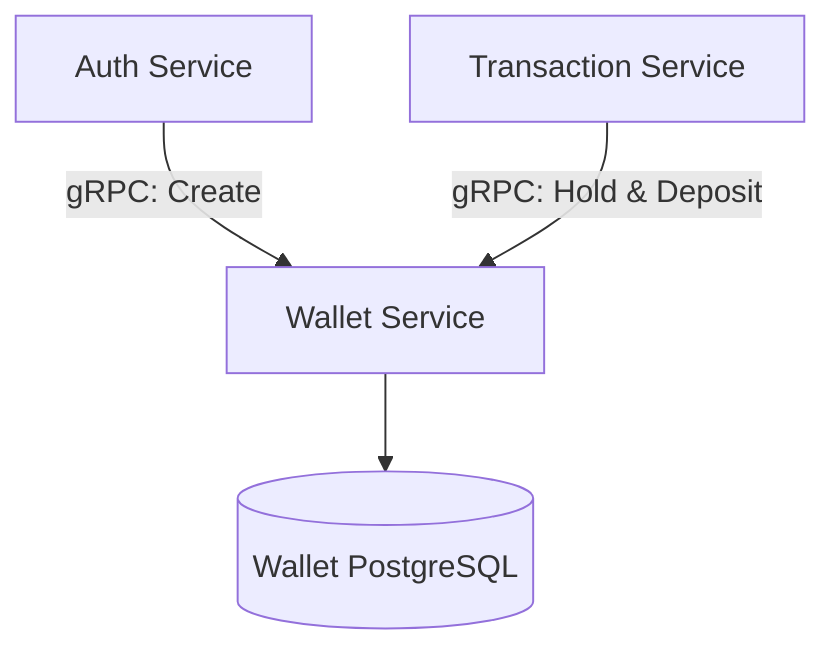

# Central Payment Ecosystem - Wallet Service

Welcome to the **Wallet Service**! This is the financial ledger of the Central Payment Ecosystem, heavily optimized for consistency and speed using gRPC.

> **Explore the Ecosystem:** This repository is part of a larger microservices architecture.
> - [API Gateway](https://github.com/sarvesh873/101_Central_API-Gateway) - The central entry point and JWT verifier.
> - [Authentication Service](https://github.com/sarvesh873/101_Central_Authentication-Service) - Manages users and registration.
> - **Wallet Service (You are here)** - Manages balances and holds.
> - [Reward Service](https://github.com/sarvesh873/101_Central_Reward-Service) - Evaluates transactions to issue rewards.
> - [Transaction Service](https://github.com/sarvesh873/101_Central_Transaction-Service) - Core engine handling two-phase commits.

---

## 🏦 Role in the Architecture

The Wallet Service acts as the source of truth for user funds. It exposes internal endpoints exclusively via **gRPC** to ensure sub-millisecond network communication with the Transaction and Authentication services.



### Core Operations:
1. **Balance Management**: High-concurrency wallet updates with optimistic locking to prevent race conditions.
2. **Funds Holding**: During a transaction, funds are explicitly moved to a "hold" state, ensuring they cannot be spent elsewhere while waiting for OTP verification.
3. **Event Consumption**: Listens to Kafka (`user-events`) for auditing or compensatory actions.

---

## 🚀 Features

- **Wallet Management**: Create and manage user wallets
- **Transaction Processing**: Handle deposits and withdrawals with transaction integrity
- **Balance Tracking**: Track both total and available balances
- **Dual API Support**: RESTful API and gRPC interfaces
- **Containerized**: Ready for Docker and Kubernetes deployment
- **Monitoring**: Integrated with Prometheus and Actuator for metrics
- **Database**: Uses PostgreSQL for data persistence
- **Kafka Integration**: For event-driven architecture

## 📋 Prerequisites

- Java 21
- Maven 3.6+
- Docker 20.10+ & Docker Compose 2.0+
- PostgreSQL 13+
- Kafka 2.8+

## 🛠️ Tech Stack

- **Framework**: Spring Boot 4.0.0
- **Build Tool**: Maven
- **Database**: PostgreSQL
- **API Documentation**: OpenAPI 3.0
- **Containerization**: Docker
- **Service Discovery**: Integrated with central service discovery
- **Monitoring**: Prometheus, Spring Boot Actuator
- **Logging**: SLF4J with Logback

## 🚀 Getting Started

### Local Development

1. **Clone the repository**
   ```bash
   git clone https://github.com/sarvesh873/101_Central_Wallet-Service
   cd 101_Central_Wallet-Service
   ```

2. **Start dependencies using Docker Compose**
   ```bash
   docker-compose up -d
   ```
   This will start PostgreSQL, Kafka, and Zookeeper.

3. **Build and run the application**
   ```bash
   mvn clean install
   mvn spring-boot:run
   ```

### Configuration

Configure the application using `application.yml`:

```yaml
spring:
  datasource:
    url: jdbc:postgresql://localhost:5432/central
    username: user
    password: password123
  jpa:
    hibernate:
      ddl-auto: update
  kafka:
    bootstrap-servers: localhost:9092

server:
  port: 8085

management:
  endpoints:
    web:
      exposure:
        include: health,info,prometheus,metrics
```

## 📚 REST API Documentation

### Wallet Management
- `POST /api/wallets` - Create a new wallet
- `GET /api/wallets/{userCode}` - Get wallet by user code

### Transaction & Balance Operations
- `POST /api/wallets/{userCode}/deposit` - Deposit funds
- `POST /api/wallets/{userCode}/withdraw` - Withdraw funds
- `GET /api/wallets/{userCode}/balance` - Get wallet balance
- `GET /api/wallets/{userCode}/available-balance` - Get available balance

**Access the UI Docs**:
- Swagger UI: `http://localhost:8085/swagger-ui.html`
- OpenAPI Docs: `http://localhost:8085/v3/api-docs`

## ⚡ gRPC Service

The service exposes gRPC endpoints for high-performance communication on port **9095** (configurable via `Wallet_SERVICE_GRPC_PORT`). The service definition is available in `src/main/proto/wallet.proto`.

### gRPC Service Methods

```protobuf
service WalletService {
  rpc CreateWallet(WalletCreateRequestGRPC) returns (WalletResponseGRPC);
  rpc GetUserWallet(GetWalletRequestGRPC) returns (WalletResponseGRPC);
  rpc DepositFunds(TransactionRequestGRPC) returns (TransactionResponseGRPC);
  rpc WithdrawFunds(TransactionRequestGRPC) returns (TransactionResponseGRPC);
  rpc GetBalance(GetWalletRequestGRPC) returns (BalanceResponseGRPC);
  rpc GetAvailableBalance(GetWalletRequestGRPC) returns (BalanceResponseGRPC);
}
```

### gRPC Client Example

```java
ManagedChannel channel = ManagedChannelBuilder.forAddress("localhost", 9095)
    .usePlaintext()
    .build();

WalletServiceGrpc.WalletServiceBlockingStub stub = 
    WalletServiceGrpc.newBlockingStub(channel);

WalletCreateRequestGRPC request = WalletCreateRequestGRPC.newBuilder()
    .setUserCode("user123")
    .setCurrency("USD")
    .build();

WalletResponseGRPC response = stub.createWallet(request);
```

## 🧪 Testing & Coverage

Run the test suite and generate coverage:
```bash
mvn test
mvn jacoco:report
```

### Coverage Thresholds
| Type       | Current | Target | Status  |
|------------|---------|--------|---------|
| Line       | 92%     | 90%    | ✅ Pass |
| Branch     | 88%     | 85%    | ✅ Pass |
| Complexity | 89%     | 85%    | ✅ Pass |
| Methods    | 95%     | 90%    | ✅ Pass |
| Classes    | 100%    | 100%   | ✅ Pass |

### Key Test Categories
1. **Service Layer**: Wallet creation, validation, concurrent transaction handling.
2. **Controller Tests**: HTTP endpoint validation, request mapping.
3. **Repository Tests**: CRUD operations, transaction management.
4. **Specification Tests**: Complex query building and filtering.

## 🚀 Deployment

### Docker
```bash
docker build -t wallet-service:latest .
docker run -p 8085:8085 -p 9095:9095 wallet-service:latest
```

### Kubernetes
Deploy using the provided manifests in the `k8s/` directory.

## 🛡️ Security & Error Handling

- **Authentication**: JWT-based (integrated with central Auth service).
- **Concurrency**: Optimistic locking for concurrency protection.
- **Errors**: Comprehensive error handling (400 Bad Request, 404 Not Found, 409 Conflict, 422 Unprocessable Entity, 500 Internal).

## 📈 Monitoring and Logging

- **Actuator Endpoints**: `/actuator/health`, `/actuator/metrics`, `/actuator/prometheus`
- **Logging**: JSON-formatted logs with Correlation IDs for request tracing.

## ✅ TODO List

- [ ] **Add Kafka consumer for async user updates**
  - Implement Kafka consumer for user update events and add retry mechanism.
- [ ] **Update User Repository**
  - Add methods for user data updates and audit logging.
- [ ] **Service Integration**
  - Set up service discovery and implement Resilience4j circuit breakers.
- [ ] **Security**
  - Add JWT authentication for admin endpoints with RBAC.

## 🤝 Contributing

1. Fork the repository
2. Create your feature branch (`git checkout -b feature/AmazingFeature`)
3. Commit your changes (`git commit -m 'Add some AmazingFeature'`)
4. Push to the branch (`git push origin feature/AmazingFeature`)
5. Open a Pull Request

## 📝 License & Contact

This project is licensed under the MIT License - see the LICENSE file for details.
For support or queries, please open an issue in the repository.
